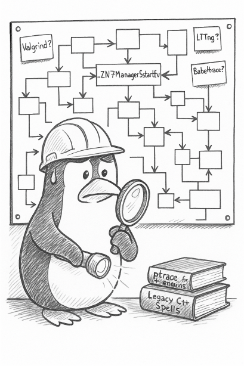

Prácticas de análisis de comportamiento de aplicaciones en C++ 
==============================================================

Ejercicios de análisis de código con herramientas gratuitas o de código abierto, orientadas a entender el comportamiento de código en tiempo de ejecución.

**Comparativa de herramientas**

- [Tools](TOOLS.md)

**Aplicación de ejemplo**

- [Calcjob](./apps/calcjob/)

**Prácticas**

- [01 Call Graphs con instrumentación de GCC](./lessons/01_callgraphs/)
- [02 Callgrind y KCachegrind](./lessons/02_callgrind/)
- [03 LTTng (Linux Trace Toolkit Next Generation)](./lessons/03_lltng/)
